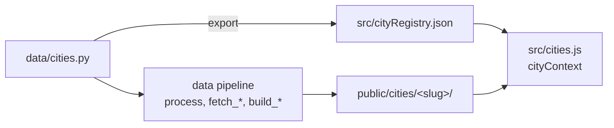

# Cities

Walksheds covers one rail system per **city**. A city is a row in the registry
plus an ingest module; nothing else in the codebase names a city.

| City | System | Agency | Lines | Stations | Capabilities |
| --- | --- | --- | --- | --- | --- |
| `seattle` | Link Light Rail | Sound Transit | 1 Line, 2 Line | 38 | `walksheds`, `pois`, `exits` |
| `honolulu` | Skyline | HART | Skyline | 13 open (of 21 planned) | `exits` |

## One registry, two consumers

`data/cities.py` is the single source of truth: map framing, lines
(id / key / label / glyph / colors / sprite color), default station, station
count, provenance, capabilities, and every per-city path.

It generates `src/cityRegistry.json`, which `src/cities.js` imports. The Python
pipeline and the browser therefore agree by construction rather than by
convention — **INV-024** fails if the committed JSON drifts from the module, and
CI has a named step that tells you to run `python3 data/cities.py`.



## Capabilities

A city declares which datasets it actually has. The frontend hides the chrome
for anything missing, so a city can ship rail-only and gain walksheds later
without the UI promising data that isn't there.

| Capability | Artifact | Requires |
| --- | --- | --- |
| `walksheds` | `data/cities/<slug>/raw/pois/walksheds.json.gz` | `MAPBOX_TOKEN` (Isochrone) |
| `pois` | `public/cities/<slug>/pois/tiles/` | `walksheds`, Overpass, Overture, `MAPBOX_TOKEN` (Matrix) |
| `exits` | `public/cities/<slug>/station-exits.geojson` | Overpass |

`pois` requires `walksheds` because POI-to-station membership *is* the isochrone
— a POI is "in" a walkshed by point-in-polygon against it.

**INV-025** keeps the declaration honest in both directions: declaring a
capability without the artifact fails, and so does having the artifact without
declaring it (which would silently hide real data).

## Layout

Shared code stays where it was. Only *data* is namespaced:

```
data/cities/<slug>/raw/            raw upstream feeds (committed)
data/cities/<slug>/raw/pois/       OSM / Mapbox dumps (committed, gzipped)
data/cities/<slug>/station-index.json
public/cities/<slug>/              everything the browser fetches
```

Most data scripts take `--city <slug>`, and many accept `--city all`. Omitting
it uses the default city, `seattle`.

## Choosing the active city

In order of precedence:

1. **A station deep link's own path** — `/honolulu/1/8`. The `{system}` segment
   is the city slug, so a shared link always lands where it was minted.
2. **`?city=<slug>`** — for linking to a city without picking a station.
3. **`localStorage`** — this browser's last choice.
4. The registry's `defaultCity`.

Switching cities clears everything tied to the old city's stations (selection,
walkshed polygons, POI filters) and re-frames the map on the new city's system
bounds before flying into its default station. The URL drops any station path: a
Seattle stop code means nothing in Honolulu.

The switcher lives in the legend and renders nothing when the registry holds a
single city. Embeds hide it by default — an embed is placed to show one city, and
letting a visitor switch would break the host's framing and its `postMessage`
contract — so opt in with `?citypicker=1`.

## Derived line order

`src/routeGraph.js` does not hardcode station orders. A station's `stopCode` is
an ordinal along its line in both cities — Sound Transit's three-digit codes
increase away from Westlake = 50, and HART's station IDs run 1..21 west to east —
so each line's order is simply its stations sorted by `stopCode`, and the
junction is the last station of the lines' common prefix (`null` for a
single-line city).

This is what makes navigation city-agnostic. It is also load-bearing for adding a
city: without a meaningful ordinal in the station feed, the order would have to
be hardcoded again. `src/__tests__/routeGraph.test.js` locks the derivation
against the real committed data to Sound Transit's published order.

## Honolulu specifics

HART publishes the whole 21-station project, not just what is open, with an `ID`
that is an authoritative west-to-east ordinal. "The open system" is therefore
just `ID <= OPEN_STATION_MAX_ID` (13 today: Segment 1 opened 2023-06-30,
Segment 2 on 2025-10-16). Opening the City Center segment is a one-number change
plus adding its guideway section and a refresh.

**Guideway.** The alignment layer is split into four named sections, each
published as a centre line plus separate east/westbound tracks. The processor
takes the three open centre lines, chains them end-to-end (greedily, reversing a
section when it is the far end that matches, and failing loudly if a joint
exceeds 400 m), trims to the open extent, and simplifies with Douglas-Peucker at
1 m — far finer than the guideway is wide, and it takes ~6,000 survey vertices
down to ~240 (497 KB → 10 KB).

**Names.** `name` is the official Hawaiian name with the ʻokina normalised to
U+02BB (HART's two fields disagree on the glyph); `altName` is the English place
descriptor riders navigate by. Four stations carry an override where HART's
Environmental Impact Statement field is stale — Kalauao is publicly Pearlridge,
Hālawa is Aloha Stadium, and so on. Station search folds diacritics and the
ʻokina and matches `altName`, so "halawa", "hoaeae" and "airport" all work from
an ASCII keyboard.

**A known wart.** HART's published guideway centre line diverges from its own
station geometry near Honouliuli (Hoʻopili) by ~400 m, with a ~1 km vertex gap in
that stretch across all three tracks. The station coordinates are the
trustworthy ones — they agree with OSM's mapped platforms to within ~6 m — and
they are what drives walksheds. The deviation is cosmetic, affecting only the
drawn route.

## Adding a city

See [`docs/adding-a-city.md`](https://github.com/robogeosociety/walksheds/blob/main/docs/adding-a-city.md)
in the repo for the full checklist, including the runbook for finishing
Honolulu's walksheds and POIs once a `MAPBOX_TOKEN` is available.
